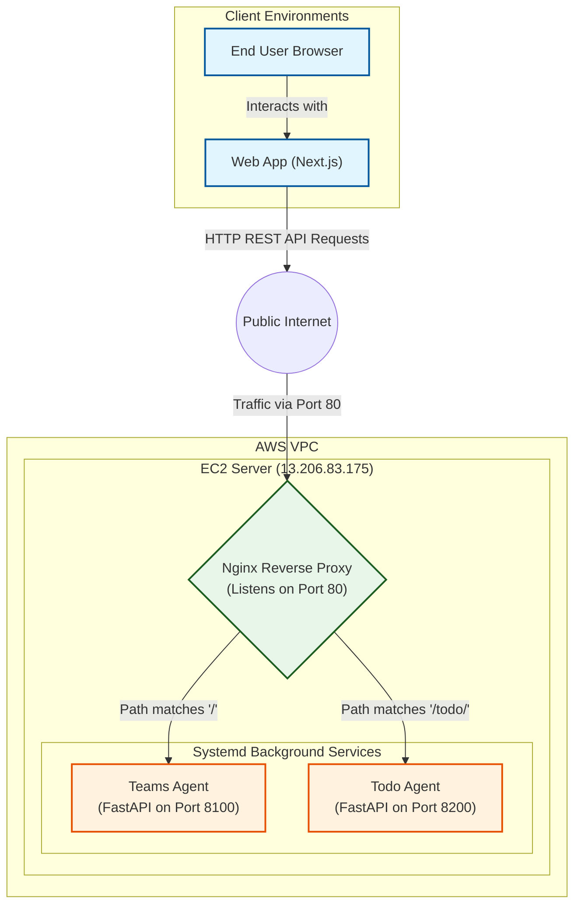

# AWS Architecture & EC2 Integration Documentation

This document provides a comprehensive overview of how AWS Elastic Compute Cloud (EC2) is utilized in our project, what each configuration file is responsible for, and how our Next.js web application interacts with these backend agents.

## 1. What is AWS EC2?

**AWS Elastic Compute Cloud (EC2)** provides scalable computing capacity (virtual servers) in the Amazon Web Services cloud. In the context of our project, we use an EC2 instance to independently host our background AI agents (`teams-agent` and `todo-agent`). By decoupling these compute-heavy agents from the main web server, we ensure that both our frontend application and our backend agents run smoothly and have their own dedicated resources.

---

## 2. File Structure of the EC2 Directory

The directory `e:\SaaS-ai\ai-everyone\EC2` contains all the necessary scripts, configuration files, and documentation required to deploy and run the agents on the EC2 machine.

```text
EC2/
│
├── deploy.sh                  # Main deployment and configuration script
├── nginx/                     # Contains Nginx web server configurations
│   └── sites-available/
│       └── agents             # The specific Nginx routing rules for our endpoints
├── systemd/                   # Contains Linux systemd service declarations
│   ├── teams-agent.service    # Background service config for the Teams Agent
│   └── todo-agent.service     # Background service config for the Todo Agent
├── API_DOCUMENTATION.md       # API Reference for the deployed agents
└── DEPLOYMENT_RUNBOOK.md      # Step-by-step guide for deploying onto EC2
```

---

## 3. Detailed Use of Folders & Files

### The `nginx/` Folder
**What is Nginx?** Nginx is a high-performance web server that we use as a **reverse proxy**. 
**Its Utility:** Security and routing efficiency. Instead of exposing our Python application ports directly to the internet, Nginx sits at the front. It securely accepts all external web traffic coming into the server, inspects the URL, and forwards it to the correct internal application.

### The `systemd/` Folder
**What is systemd?** Systemd is a system and service manager for Linux operating systems.
**Its Utility:** It converts our Python scripts into reliable background applications (daemons). By defining `.service` files, systemd ensures that if our server ever crashes, restarts, or an agent experiences a fatal error, the agent processes will be instantly and automatically booted back up (`Restart=always`). It manages the lifecycle and logs of our agents.

### The `deploy.sh` File
**What is it?** A bash automation script meant to be run on the EC2 server itself (e.g., Ubuntu).
**Its Utility:** Instead of manually typing out commands to configure our server, this script automatically handles it all. It updates the operating system, installs Python and Nginx, sets up virtual environments for isolation, installs dependencies, copies over the `systemd` and `nginx` configurations to their required Linux system folders, and finally starts up our agents.

---

## 4. Exposed Ports and Network Routing

The EC2 instance uses Nginx to receive external traffic and route it internally. Here is how the ports are mapped:

- **Internal Ports (Not Exposed):** Our Python FastAPI applications run locally on the server.
  - **Teams Agent** runs on `localhost:8100`
  - **Todo Agent** runs on `localhost:8200`
- **External Ports (Exposed):** 
  - The EC2 instance securely exposes only **Port 80 (Standard HTTP)** to the internet via Nginx.

**How Routing Works:**
- When a request hits `http://13.206.83.175/todo/`, Nginx receives it on Port 80 and invisibly passes it to the Todo Agent on `127.0.0.1:8200`.
- When a request hits `http://13.206.83.175/`, Nginx receives it on Port 80 and passes it to the Teams Agent on `127.0.0.1:8100`.

---

## 5. How Our Web App Connects to EC2

Our Next.js web application acts as the client. It makes standard HTTP REST API requests to the public IP address of the EC2 instance (`13.206.83.175`) on port 80. Nginx distributes these requests. Thus, the Web App never speaks directly to the Python application, but to the Nginx Reverse Proxy, which handles the secure handoff.

---

## 6. Most Important EC2 Commands

When logged into the EC2 instance via SSH, these are the most common commands used to manage the project:

- **Deploy / Setup Server:**
  `sudo ./deploy.sh`
- **Check Teams Agent Status & Recent Logs:**
  `sudo systemctl status teams-agent --no-pager`
- **Check Todo Agent Status & Recent Logs:**
  `sudo systemctl status todo-agent --no-pager`
- **Restart an Agent (E.g., after a code update):**
  `sudo systemctl restart teams-agent` or `sudo systemctl restart todo-agent`
- **Check Server Nginx Health:**
  `sudo systemctl status nginx`
- **Ping the Agents for uptime validation:**
  `curl http://13.206.83.175/health` (Teams)
  `curl http://13.206.83.175/todo/health` (Todo)

---

## 7. Data Flow Architecture

Below is a visual representation of how a request moves from the user interfaces all the way down to the internal services on the EC2 machine.



---

## 8. Process for Adding a New Agent

If you need to introduce a new agent (e.g., `notion-agent`) in the future, you must update both the web app integration and the EC2 deployment structure. Here is the end-to-end installation flow:

### Step 1: Web App Integration
To register the agent so the parent AI knows it exists:
1. **Update `AGENT_REGISTRY`**: Open `src/app/api/chat/route.ts` and add a new entry to the `AGENT_REGISTRY` array with the agent's ID, description, and available actions. This helps the LLM perform its tag-based intent detection.
2. **Update Cloud Functions (Production)**: Open `functions/index.js` and add the new agent's internal routing URL mapping into the `AGENT_ROUTES` object.

### Step 2: EC2 Folder Modifications
Next, the actual agent must be deployed and configured on the web server:
1. **Create the Agent Source Folder**: Create a new directory under `e:\SaaS-ai\ai-everyone\EC2\agents\<new-agent>`. Add the agent's Python code, the `server.py` (FastAPI wrapper exposing a unique port, e.g., `8300`), and a `requirements.txt` file detailing its dependencies.
2. **Add a `systemd` Service File**: Create `e:\SaaS-ai\ai-everyone\EC2\systemd\<new-agent>.service`. Point `WorkingDirectory` to the new agent directory, define the execution command `ExecStart` (e.g., `uvicorn server:app --port 8300`), and ensure `Restart=always` is set.
3. **Update Nginx Configuration**: Open `e:\SaaS-ai\ai-everyone\EC2\nginx\sites-available\agents`. Add a new `upstream` block pointing to `127.0.0.1:8300` and a new `location /<new-agent>/` block to route external traffic to the new internal process.
4. **Update `deploy.sh`**: Open `e:\SaaS-ai\ai-everyone\EC2\deploy.sh`.
   - Define your new agent directory variable: `NEW_AGENT_DIR="${APP_DIR}/agents/<new-agent>"`
   - Add the directory to the required directory checks block.
   - Under `setup_python_env`, call the setup command for the new agent: `setup_python_env "${NEW_AGENT_DIR}"`.
   - Update `install_systemd_units` to copy the new `.service` file.
   - Update `start_services` to enable and restart the new systemd service.

### Step 3: Deployment
SSH into the EC2 server and pull the latest code repository containing your updates. Then, run the deployment script:
```bash
sudo ./deploy.sh
```
The script will automatically set up the Python environment with your dependencies, register and boot up your new background systemd service, apply the Nginx routing changes, and immediately expose the new agent to the Next.js web application.
