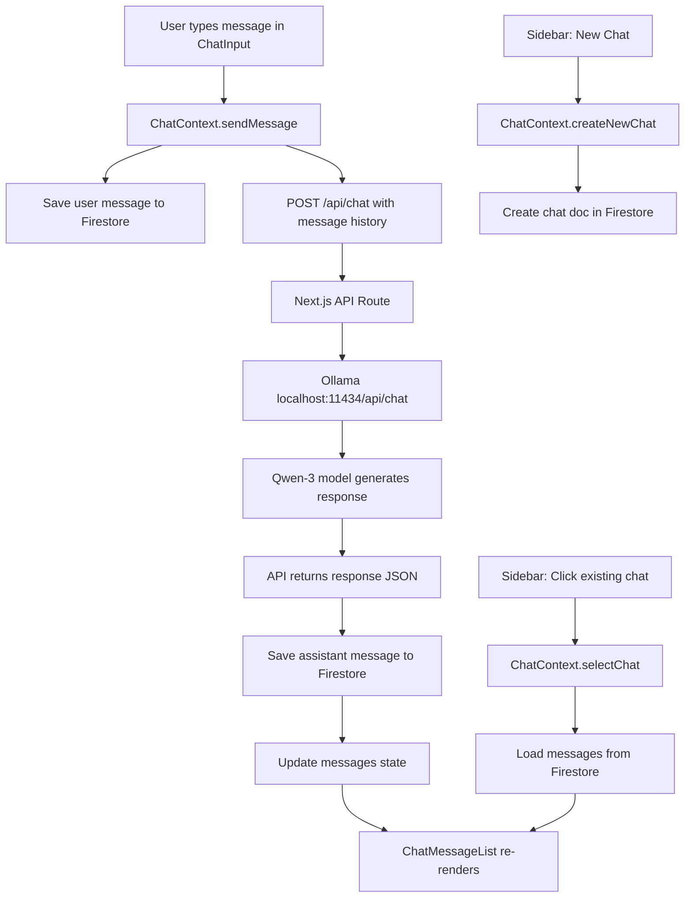

# Chat System Integration — AI Everywhere × Chatbot-UI

Adapt the Chatbot-UI chat pipeline into the existing AI Everywhere project. Replace all multi-provider logic with a **single Ollama/Qwen-3** backend, replace Supabase DB calls with **Firebase Firestore**, and integrate the chat UI into the **existing dark-themed dashboard** without replacing any current components.

## User Review Required

> [!IMPORTANT]
> **Ollama must be running** on `localhost:11434` with the cloud model pulled (`ollama pull qwen3.5:397b-cloud`) for the chat to work.

> [!IMPORTANT]Markdown:
> **No streaming initially.** The first version sends `"stream": false` to Ollama and returns the full response at once. Streaming can be added as a follow-up enhancement.

> [!WARNING]
> The `react-markdown` and `remark-gfm` packages will be installed as new dependencies for rendering AI responses with proper markdown formatting (code blocks, lists, etc.).

---

## Proposed Changes
### 1. Environment Configuration

#### [MODIFY] [.env](file:///c:/Users/Ayush/Desktop/SaaS-ai/ai-everyone/.env)

Add Ollama configuration:
```
OLLAMA_BASE_URL=http://host.docker.internal:11434
OLLAMA_MODEL_CLOUD=qwen3.5:397b-cloud
OLLAMA_MODEL_LOCAL=qwen2.5:7b
OLLAMA_DEFAULT_MODEL=qwen3.5:397b-cloud
```
These are server-only env vars (no `NEXT_PUBLIC_` prefix) since the Ollama API is called from the Next.js API route only.

---

### 2. Chat Module — Types & DB Layer

Following the existing pattern of `src/modules/{feature}/...`, all chat logic lives under `src/modules/chat/`.

#### [NEW] [types.ts](file:///c:/Users/Ayush/Desktop/SaaS-ai/ai-everyone/src/modules/chat/types.ts)

Core TypeScript interfaces adapted from Chatbot-UI's [types/chat.ts](file:///e:/chatbot-ui/types/chat.ts) and [types/chat-message.ts](file:///e:/chatbot-ui/types/chat-message.ts):

- `Chat` — `{ id, userId, title, createdAt, updatedAt }`
- `ChatMessage` — `{ id, chatId, role: "user" | "assistant", content, createdAt }`

#### [NEW] [chats.ts](file:///c:/Users/Ayush/Desktop/SaaS-ai/ai-everyone/src/modules/chat/db/chats.ts)

Firebase Firestore CRUD for chats collection (adapted from Chatbot-UI's [db/chats.ts](file:///e:/chatbot-ui/db/chats.ts)):

- `createChat(userId, title)` → adds doc to `users/{uid}/chats`
- `getChats(userId)` → queries all chats for a user, ordered by `updatedAt` desc
- `getChatById(userId, chatId)` → fetches a single chat
- `updateChat(userId, chatId, data)` → updates title or updatedAt
- `deleteChat(userId, chatId)` → deletes chat and all its messages

Uses the existing `db` instance from [src/lib/firebase.ts](file:///c:/Users/Ayush/Desktop/SaaS-ai/ai-everyone/src/lib/firebase.ts).

#### [NEW] [messages.ts](file:///c:/Users/Ayush/Desktop/SaaS-ai/ai-everyone/src/modules/chat/db/messages.ts)

Firebase Firestore CRUD for messages (adapted from Chatbot-UI's [db/messages.ts](file:///e:/chatbot-ui/db/messages.ts)):

- `createMessage(userId, chatId, message)` → adds doc to `users/{uid}/chats/{chatId}/messages`
- `getMessages(userId, chatId)` → queries all messages for a chat, ordered by `createdAt` asc
- `deleteMessages(userId, chatId)` → deletes all messages in a chat (used when deleting a chat)

---

### 3. Chat Context (State Management)

Simplified version of Chatbot-UI's `context.tsx` and `global-state.tsx`.

#### [NEW] [chat-context.tsx](file:///c:/Users/Ayush/Desktop/SaaS-ai/ai-everyone/src/modules/chat/context/chat-context.tsx)

React context + provider holding the chat state:

- `chats: Chat[]` — list of all user's chats
- `activeChatId: string | null` — currently selected chat
- `messages: ChatMessage[]` — messages in the active chat
- `isGenerating: boolean` — whether the AI is currently responding
- `loadChats()` — fetches chats from Firestore
- `createNewChat()` — creates a new chat, sets it active
- `selectChat(chatId)` — loads messages for that chat
- `sendMessage(content)` — sends user message, calls API, saves both messages
- `deleteChat(chatId)` — deletes a chat

The provider will wrap the dashboard layout.

---

### 4. Ollama API Route

#### [NEW] [route.ts](file:///c:/Users/Ayush/Desktop/SaaS-ai/ai-everyone/src/app/api/chat/route.ts)

Single Next.js API route that replaces **all** Chatbot-UI provider routes. Receives:

```json
{ "messages": [{ "role": "user", "content": "Hello" }, ...] }
```

Sends to Ollama:

```json
POST http://localhost:11434/api/chat
{
  "model": "qwen3.5:397b-cloud",
  "messages": [{ "role": "user", "content": "Hello" }, ...],
  "stream": false
}
```

Returns the response as JSON `{ "content": "..." }`. Uses the `/api/chat` endpoint of Ollama (multi-turn conversation format) instead of `/api/generate` (single prompt format) for proper chat context.

---

### 5. Chat UI Components

#### [NEW] [chat-message-item.tsx](file:///c:/Users/Ayush/Desktop/SaaS-ai/ai-everyone/src/modules/chat/ui/components/chat-message-item.tsx)

Renders a single message bubble (user or assistant). Adapted from Chatbot-UI's `message.tsx`:
- User messages: right-aligned, dark bg
- Assistant messages: left-aligned with markdown rendering
- Uses `react-markdown` + `remark-gfm` for rendering assistant content

#### [NEW] [chat-message-list.tsx](file:///c:/Users/Ayush/Desktop/SaaS-ai/ai-everyone/src/modules/chat/ui/components/chat-message-list.tsx)

Scrollable message container (adapted from Chatbot-UI's `chat-messages.tsx`):
- Maps over `messages` array and renders `ChatMessageItem` for each
- Auto-scrolls to bottom on new messages
- Shows a typing indicator when `isGenerating` is true

#### [NEW] [chat-input.tsx](file:///c:/Users/Ayush/Desktop/SaaS-ai/ai-everyone/src/modules/chat/ui/components/chat-input.tsx)

Chat input bar that reuses the same visual style as the existing [HomeView](file:///c:/Users/Ayush/Desktop/SaaS-ai/ai-everyone/src/modules/home/ui/views/home-view.tsx#30-170) prompt bar:
- Rounded dark container matching `#0C0D0D` bg
- Includes the existing [AttachFile](file:///c:/Users/Ayush/Desktop/SaaS-ai/ai-everyone/src/modules/home/ui/views/home-view.tsx#79-86) and [TextToSpeech](file:///c:/Users/Ayush/Desktop/SaaS-ai/ai-everyone/src/modules/home/ui/views/home-view.tsx#87-95) buttons
- Adds a Send button (arrow icon) that appears when text is entered
- Enter to send, Shift+Enter for newline
- Disabled while `isGenerating` is true

#### [NEW] [chat-view.tsx](file:///c:/Users/Ayush/Desktop/SaaS-ai/ai-everyone/src/modules/chat/ui/views/chat-view.tsx)

Main chat view replacing/extending the [HomeView](file:///c:/Users/Ayush/Desktop/SaaS-ai/ai-everyone/src/modules/home/ui/views/home-view.tsx#30-170):
- If no active chat and no messages → shows the greeting + centered input (HomeView style)
- If there's an active chat with messages → shows `ChatMessageList` at top + `ChatInput` pinned at bottom
- Full height layout using flex column

#### [NEW] [chat-sidebar-list.tsx](file:///c:/Users/Ayush/Desktop/SaaS-ai/ai-everyone/src/modules/chat/ui/components/chat-sidebar-list.tsx)

Chat history list for the sidebar (adapted from Chatbot-UI's `chat-item.tsx`):
- Renders each chat as a clickable item with the chat title
- Active chat is highlighted
- Delete button on hover
- Clicking a chat calls `selectChat(chatId)`

---

### 6. Integration into Existing Layout

#### [MODIFY] [dashboard-sidebar.tsx](file:///c:/Users/Ayush/Desktop/SaaS-ai/ai-everyone/src/modules/dashboard/ui/components/dashboard-sidebar.tsx)

Add the chat history list between the top nav items and the settings section:
- The "New Chat" button already exists → wire it to `createNewChat()` from chat context
- Below the existing separator, add the `ChatSidebarList` component
- Keep all existing items (Agents, Settings) as-is

#### [MODIFY] [layout.tsx (dashboard)](file:///c:/Users/Ayush/Desktop/SaaS-ai/ai-everyone/src/app/(auth)/(dashboard)/layout.tsx)

Wrap the dashboard layout with `ChatProvider` so all child components can access chat state.

#### [MODIFY] [page.tsx (dashboard)](file:///c:/Users/Ayush/Desktop/SaaS-ai/ai-everyone/src/app/(auth)/(dashboard)/page.tsx)

Replace `<HomeView />` with `<ChatView />`, which internally handles both the greeting (no active chat) and the conversation view (active chat with messages).

---

### 7. Package Dependencies

#### [MODIFY] [package.json](file:///c:/Users/Ayush/Desktop/SaaS-ai/ai-everyone/package.json)

Install:
- `react-markdown` — render AI responses as formatted markdown
- `remark-gfm` — GitHub Flavored Markdown support (tables, strikethrough, etc.)

---

## Architecture Diagram



## Firestore Data Structure

```
users/
  {uid}/
    chats/
      {chatId}/
        title: string
        createdAt: Timestamp
        updatedAt: Timestamp
        messages/
          {messageId}/
            role: "user" | "assistant"
            content: string
            createdAt: Timestamp
```

---

## Verification Plan

### Build Verification
1. Run `npm run build` in `c:\Users\Ayush\Desktop\SaaS-ai\ai-everyone` to confirm no TypeScript or build errors

### Manual Browser Testing

Since this project has no automated test framework (`jest`, `vitest`, etc.) set up, verification will be manual:

1. **Start the dev server**: Run `npm run dev` in `c:\Users\Ayush\Desktop\SaaS-ai\ai-everyone`
2. **Start Ollama**: Ensure Ollama is running with `qwen3.5:397b-cloud` model available
3. **Login**: Navigate to the app and sign in
4. **Send a message**: Type a message in the input bar and press Enter. Verify:
   - A user message bubble appears
   - A loading indicator shows while waiting
   - An AI response appears below the user message
5. **Chat in sidebar**: Verify the new chat appears in the sidebar with an auto-generated title
6. **Create new chat**: Click "New Chat" in sidebar. Verify the view resets to the greeting screen
7. **Switch chats**: Click a previous chat in the sidebar. Verify the messages load correctly
8. **Delete chat**: Hover over a chat in sidebar, click delete. Verify it's removed

> [!NOTE]
> If Ollama is not running, the API route will return an error. The UI should display an error message in that case rather than crashing.
