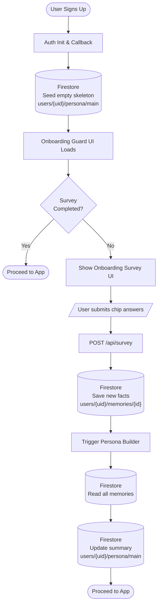
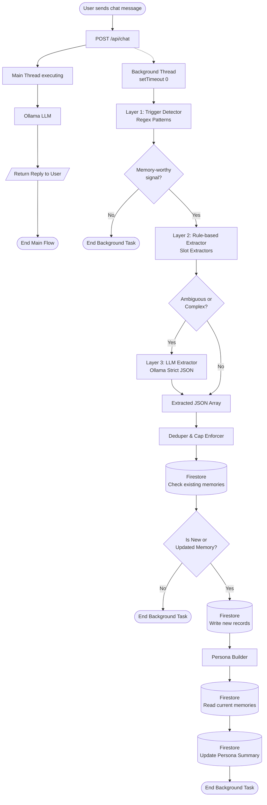
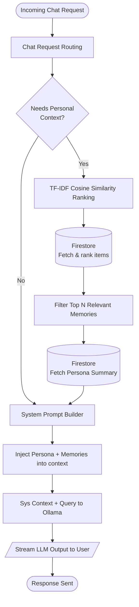

# Persona / Memory Architecture

> **Status**: v1.0 — Implemented  
> **Location**: `src/lib/memory/`, `src/modules/onboarding/`, `memory-extraction/`  
> **Depends on**: Firestore (via Firebase Admin SDK), existing `users/{uid}` schema

---

## Overview

The Persona/Memory system gives the app a persistent, structured understanding of each user. It powers:

- More relevant chat replies (personalized context)
- Better agent routing and recommendations
- Temporary context tracking (interview prep, active projects, learning goals)

The system is built in 5 flows:

| Flow | Name | Description |
|------|------|-------------|
| A | Onboarding Survey | Collects initial facts on first login |
| B | Chat Trigger Detection | Detects memory-worthy signals in messages |
| C | Structured Extraction + Dedup | Extracts and deduplicates facts |
| D | Persona Assembly | Builds a compact summary for prompts |
| E | Retrieval & Recommendation | Semantic ranking for context injection |

---

## High-Level System Architecture Diagrams

The system architecture is divided into three primary flows: **Onboarding & Initialization**, **Background Extraction Pipeline**, and **Context Retrieval & Generation**.

### 1. Onboarding & Memory Initialization Flow
This flow handles the creation of the user's base persona skeleton and the ingestion of initial structured facts via the onboarding survey.



### 2. Chat Extraction Pipeline (Fire-and-forget)
When a user sends a chat message, the main thread responds immediately. In parallel, a fire-and-forget extraction pipeline distills long-term memory facts.



### 3. Context Retrieval & Persona Injection
When processing a query, the system evaluates if personal context is required. If needed, it fetches the Persona Summary and relevant specific memory items using TF-IDF ranking.



---

## Deep Dive: Retrieval Mechanism (TF-IDF)

To ensure high performance and low cost, the system uses a **Local TF-IDF (Term Frequency-Inverse Document Frequency)** ranking engine rather than a global vector database.

### 1. Why TF-IDF?
- **Zero Cost**: No external embedding APIs (OpenAI/HuggingFace) or managed Vector DB subscriptions.
- **Privacy**: All text data remains on your server; no third-party data processing.
- **Horizontal Scaling**: Since ranking is performed **per-user** on their local 20-50 memory items, the operation is $O(k)$ where $k$ is small. It scales perfectly to millions of users.

### 2. The 4-Step Vectorization Process
The retrieval logic in `src/lib/memory/retrieval.ts` follows these steps:

1.  **Tokenization**: The user query and candidate memories are converted to lowercase and stripped of punctuation.
2.  **Vocabulary Building**: A unique set of all distinct words across the input documents is built (the "Feature Space").
3.  **Vectorization (TF)**: Each document is transformed into a numerical vector where each position is the frequency of that word in the document.
4.  **Cosine Similarity**: The system calculates the mathematical "angle" between the query vector and each memory vector.
    - Score of `1.0`: Identical word distribution.
    - Score of `0.0`: No overlapping words.

### 3. Execution Flow
When a user sends a message:
1.  We fetch the user's `Persona Summary` and `MemoryItems` from Firestore.
2.  We perform the TF-IDF ranking (takes < 2ms).
3.  The Top **K** (default: 7) most relevant items are formatted as context.
4.  This context is prepended to the System Prompt before calling the LLM.

See [persona_memory_cost_analysis.md](./persona_memory_cost_analysis.md) for detailed scale calculations (1M+ users).

---

## File Map

| Document | Content |
|----------|---------|
| [persona_memory_database_schema.md](./persona_memory_database_schema.md) | Firestore collections, fields, types |
| [persona_memory_extraction_pipeline.md](./persona_memory_extraction_pipeline.md) | 3-layer extraction detail, regex patterns, LLM prompt |
| [persona_memory_onboarding_survey.md](./persona_memory_onboarding_survey.md) | Survey UX, steps, chip options, skip policy |
| [persona_memory_cost_analysis.md](./persona_memory_cost_analysis.md) | Performance at scale (1M users), Firestore costs vs Vector DBs |

---

## File Map

```
src/lib/memory/
├── types.ts                    ← Shared TypeScript types
├── memory-repository.server.ts ← Firestore CRUD (Admin SDK)
├── trigger-detector.ts         ← Layer 1: regex pattern matching
├── extractor.ts                ← Layer 2+3: rule + LLM extraction
├── deduper.ts                  ← Dedup, cap enforcement, expiry
├── persona-builder.ts          ← Builds PersonaSummary from memories
└── retrieval.ts                ← TF-IDF cosine similarity ranking

src/modules/onboarding/
├── types.ts                    ← SurveyStep, SurveyAnswer types
└── ui/
    ├── onboarding-survey.tsx   ← 4-step chip-based modal
    └── onboarding-guard.tsx    ← Auth guard that shows survey

src/app/api/
├── chat/route.ts               ← Modified: fire-and-forget extraction
├── memory/route.ts             ← GET/DELETE/PATCH memories
└── survey/route.ts             ← POST survey answers

src/modules/profile/ui/
└── memory-manager.tsx          ← View/edit/delete memories UI

memory-extraction/
├── main.py                     ← Standalone CLI extraction tool
├── requirements.txt
└── README.md
```

---

## Key Design Decisions

### 1. Non-blocking Extraction
Chat replies are never blocked by memory extraction. The extraction pipeline runs as a `setTimeout(..., 0)` callback after the API call returns. This ensures zero latency impact on the main chat flow.

### 2. Conditional Persona Injection
The persona summary is **not** injected on every request. It is only fetched and prepended to the system prompt when:
- The query looks like it needs personal context (detected via a lightweight check)
- The user explicitly asks something that benefits from knowing their background

This avoids unnecessary token consumption.

### 3. Predefined Memory Skeleton
When a new user is created, a skeleton document is written to `users/{uid}/persona/main` with all expected memory keys set to `undefined`. This ensures consistent schema across all users. Survey answers fill in the values; skipped steps push `undefined`.

### 4. Hard Caps
- Max **20 active memories** per user
- Max per-type limits enforced by the deduper
- Temporary memories expire after **30 days**
- Priority order for eviction: miscellaneous → temporary context → education → project → skill → preference → goal → role

### 5. Cosine Similarity (TF-IDF, v1)
Used only for **ranking** relevant memories against the current user query — not for deduplication. Deduplication is done by exact normalized key+value matching. No external embedding API is required in v1.

---

## Verification

```bash
# Enter the Docker container
docker exec -it Pian bash

# Type-check all new files
npx tsc --noEmit

# Test Python extraction script
cd memory-extraction
pip install -r requirements.txt
python main.py --message "I am a developer working on React"
```

See [persona_memory_extraction_pipeline.md](./persona_memory_extraction_pipeline.md) for manual test flows.
