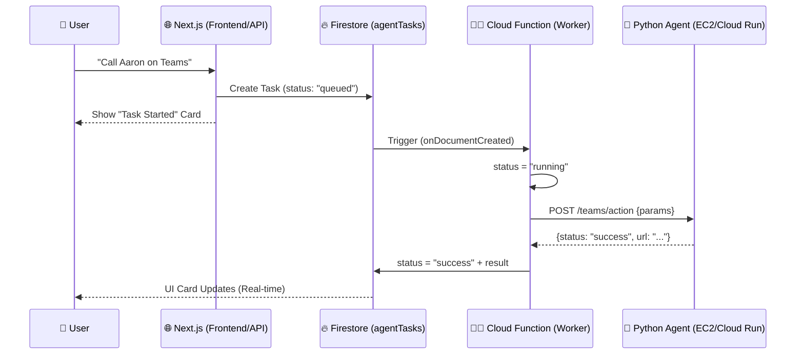

# Production Architecture Plan: Agent Orchestration

This document outlines the professional-grade architecture for the SnitchX agentic model integration. In production, we move from "Direct Execution" to an "Event-Driven" model to ensure scalability and reliability.

---

## 🏗️ The "Chef & Kitchen" Model

To handle long-running agent tasks without timing out the web frontend, we use a decoupled orchestration system.

### 1. The Worker (Firebase Cloud Function) — *The Chef*
*   **Role**: Orchestrator / Task Runner.
*   **Logic**: Lives inside Google Cloud and "watches" the `agentTasks` Firestore collection.
*   **Behavior**: It is **event-driven**. It stays idle (zero cost) until a new task is created. When it "wakes up," it reads the task parameters, calls the specialized Agent, and updates the task status once complete.
*   **Why?**: It persists even if the user's browser closes or the Next.js server restarts.

### 2. The Agent (Python Fast API) — *The Service/Kitchen*
*   **Role**: Specialized Domain Logic.
*   **Logic**: Contains the actual tools (Microsoft Teams API, To-Do Database, etc.).
*   **Behavior**: Exposes a REST API (`/teams/action`, `/todo/action`) that the "Chef" can call.

### 3. The Hosting Platform — *The Restaurant*
In production, your local `localhost:8000` is invisible to the cloud. You must host your Agents on a platform with a **Public URL**:
*   **AWS EC2 / GCP Compute Engine**: A virtual machine that is always running.
*   **Google Cloud Run / AWS Lambda**: A serverless platform that spins up only when needed.

---

## 📊 Data Flow Diagram

---

## ⚖️ Trade-offs: Serverless vs. Dedicated

When choosing between **Cloud Run (Serverless)** and **EC2 (Dedicated)**, consider these factors:

| Factor | Serverless (Cloud Run / Lambda) | Dedicated (EC2 / VM) |
| :--- | :--- | :--- |
| **Cost** | 🟢 Extremely low (Pay-per-use) | 🔴 High (Pay 24/7) |
| **Scaling** | 🟢 Automatic (0 to 1000s) | 🟡 Manual / Auto-scaling groups |
| **Latency** | 🔴 **Cold Starts** (The "Jump Start") | 🟢 **Always Ready** (Instant) |
| **Maintenance** | 🟢 Zero (No OS updates) | 🔴 Regular (OS & Security patches) |

### 🛠️ The "Cold Start" (Jump Start) Problem
If an agent only runs 10 times a day, **Cloud Run** might "spin down" to save money. The 11th call will experience a **3–5 second delay** as the server "boots up."
*   **Recommendation**: Use Cloud Run for most agents to save cost. If 3 seconds is too slow, set a `min-instances: 1` in Cloud Run to keep one instance always "warm."

---

## 🔗 Related Documentation
- [Architecture: Dev vs Prod](file:///e:/SaaS-ai/ai-everyone/Documentation/architecture_dev_vs_prod.md)
- [Agentic Model Integration](file:///e:/SaaS-ai/ai-everyone/Documentation/agentic_model_integration.md)
