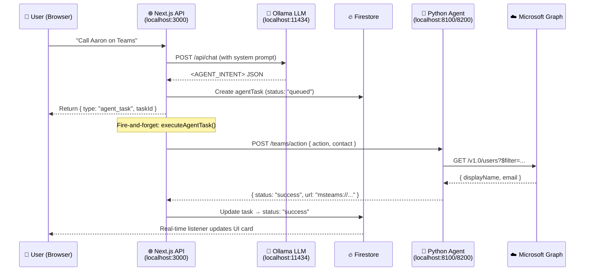
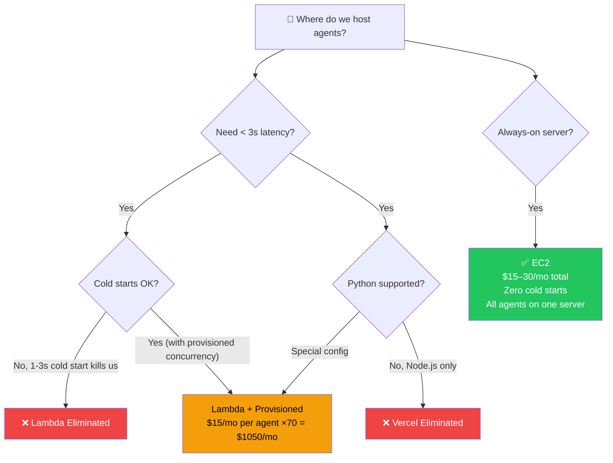
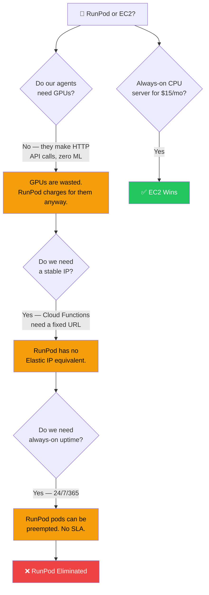
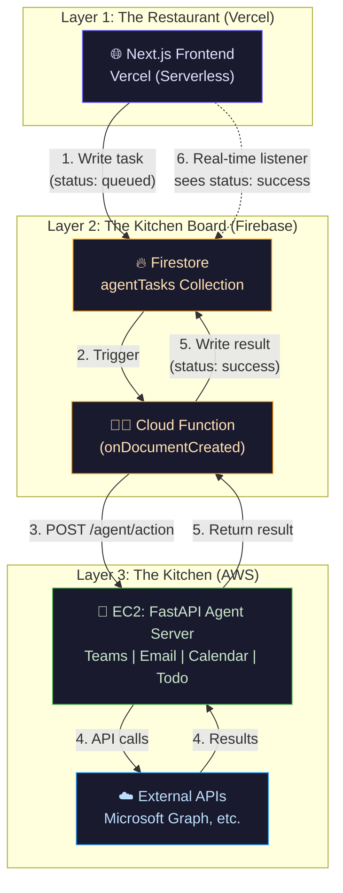
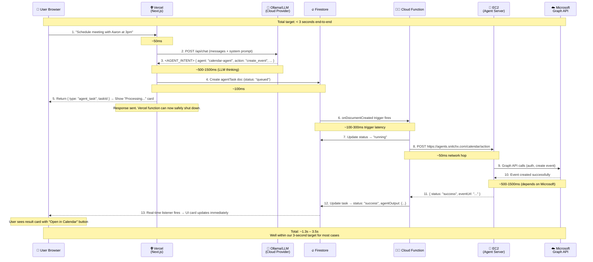
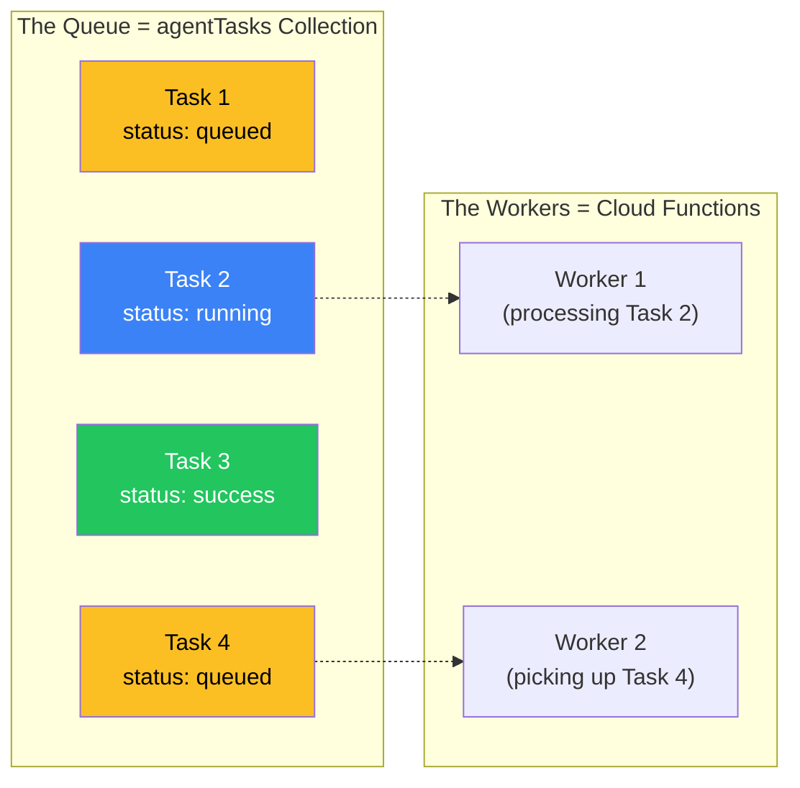
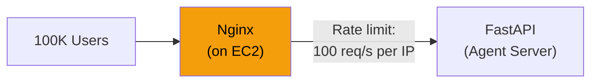
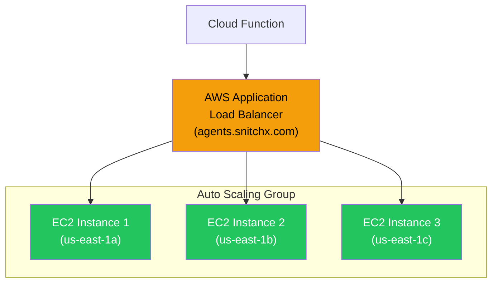
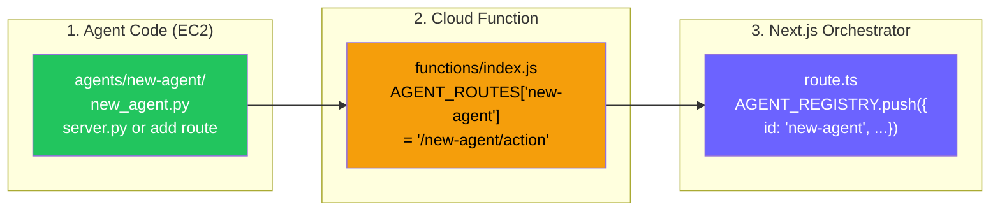

# Production Architecture Plan: Agent Cloud Deployment

This document is the single source of truth for deploying SnitchX agents from your local development environment to the cloud. It covers **why** we need cloud deployment, **what** changes, **how** everything connects, and the **exact steps** to make it happen.

> [!IMPORTANT]
> Read this document end-to-end before starting any deployment work. Every section builds on the previous one.

---

## Table of Contents

1. [The Big Picture — Why We Need This](#1-the-big-picture)
2. [What We Have Today (Local Development)](#2-what-we-have-today)
3. [The Hosting Decision: EC2 vs Lambda vs Vercel](#3-the-hosting-decision)
4. [Why Not RunPod? AWS EC2 vs RunPod](#4-why-not-runpod)
5. [The Chosen Architecture: EC2 + Firebase Cloud Functions](#5-the-chosen-architecture)
6. [Full Data Flow: User Prompt → Agent Result](#6-full-data-flow)
7. [What Changes: Local → Cloud](#7-what-changes-local--cloud)
8. [Task Queue, Rate Limiting & Load Balancing](#8-task-queue-rate-limiting--load-balancing)
9. [AWS EC2 Setup: Step-by-Step](#9-aws-ec2-setup-step-by-step)
10. [Firebase Cloud Functions: Configuration](#10-firebase-cloud-functions-configuration)
11. [Scaling to 70+ Agents](#11-scaling-to-70-agents)
12. [Cost Estimation](#12-cost-estimation)
13. [Deployment Checklist](#13-deployment-checklist)
14. [Related Documentation](#14-related-documentation)

---

## 1. The Big Picture

### Why Can't We Just Deploy Everything on Vercel?

When you deploy a Next.js app to **Vercel**, you are deploying it as a collection of **serverless functions**. These functions have a hard time limit — typically **10 seconds** for the Hobby plan, **60 seconds** for the Pro plan. After that time, Vercel kills the function, no matter what it was doing.

Our agents (like the Teams agent that resolves contacts via Microsoft Graph, or the Calendar agent that creates events) can take **2–8 seconds** to complete. If we tried to run the agent Python code directly inside the Vercel function:

1. **No Python runtime**: Vercel runs Node.js. Our agents are Python (FastAPI/uvicorn). You can't run Python inside a Vercel function natively.
2. **Timeout risk**: Even if we rewrote agents in Node.js, heavy agents would exceed the timeout.
3. **No persistent processes**: Vercel functions spin up for one request and die. You can't keep a Python server running 24/7.

**Bottom line**: Vercel hosts the **frontend** (Next.js). The **agents** (Python) need their own home — a cloud server with a **public URL** that never sleeps.

### What Changes in Production?

In local development, everything lives on your laptop. The Next.js app calls `http://localhost:8100` to reach the Python agent. In production:

- Next.js lives on **Vercel** (or similar).
- Python agents live on **AWS EC2** (a virtual server).
- They can't see each other's `localhost` — they communicate over the **public internet** using HTTPS.

---

## 2. What We Have Today

### Current Agent Inventory

We currently have **2 FastAPI servers** hosting **4 agents**:

| Server (Port) | Agent ID | Endpoint | What It Does |
|:--|:--|:--|:--|
| `teams-agent` (8100) | `teams-agent` | `POST /teams/action` | Teams calls, messages, meetings via Microsoft Graph |
| `teams-agent` (8100) | `email-agent` | `POST /email/action` | Read/send/search emails via Microsoft Graph |
| `teams-agent` (8100) | `calendar-agent` | `POST /calendar/action` | View/create/delete calendar events via Microsoft Graph |
| `todo-agent` (8200) | `todo-agent` | `POST /todo/action` | Personal to-do list backed by Firestore |

### Current Data Flow (Local Development)



### Why This Works Locally But Not in Production

| Aspect | Local Dev | Production (Vercel) |
|:--|:--|:--|
| **Networking** | Next.js and Python share `localhost` | Vercel is in AWS us-east-1; Python is somewhere else — they can't see each other's `localhost` |
| **Process lifetime** | Your laptop stays on; `executeAgentTask()` runs forever | Vercel kills the function the moment it returns the HTTP response — `executeAgentTask()` never finishes |
| **Cloud Function triggers** | Firebase Cloud Functions can't reach your laptop | With a public URL, Cloud Functions work perfectly |

---

## 3. The Hosting Decision

### The Three Options

We evaluated three options for hosting our Python agents. Here is a **detailed comparison** tailored to our exact situation.

#### Option A: AWS Lambda (Serverless Functions)

**What it is**: Lambda runs your code only when triggered. You upload a function, AWS runs it when called, and shuts it down after.

| Criteria | Rating | Details |
|:--|:--|:--|
| **Cold Start** | 🔴 BAD | Python Lambdas have **1–3 second cold starts**. With our 3-second latency budget, this eats the entire budget before the agent even starts working. |
| **Cost** | 🟢 GREAT | Pay only for execution time. ~$0.20 per 1M requests. Near-zero at low volume. |
| **Scaling** | 🟢 GREAT | Auto-scales from 0 to 1000s of instances automatically. |
| **70 agents** | 🔴 BAD | Each agent route needs its own Lambda function, or a complex API Gateway routing layer. 70 agents = 70+ Lambda deployments to manage. |
| **Warm-keeping** | 🟡 OK | You can use "Provisioned Concurrency" to keep instances warm, but that costs ~$15/month per warm instance — defeating the cost advantage. |
| **Python deps** | 🟡 OK | Must package all deps in a Lambda Layer. MSAL, requests, firebase-admin add ~50MB. Limit is 250MB unzipped. |
| **Auth flow** | 🔴 BAD | Our MSAL device flow stores `auth_store` in memory. Lambda functions are stateless — the auth token disappears after every call. Requires a rewrite to use external token storage (Firestore/Redis). |

#### Option B: AWS EC2 (Dedicated Virtual Machine)

**What it is**: A virtual computer in the cloud that is always running, 24/7. You install anything you want, like your own laptop in a data center.

| Criteria | Rating | Details |
|:--|:--|:--|
| **Cold Start** | 🟢 NONE | Server is always running. Instant response. Agent execution time is the *only* latency.|
| **Cost** | 🟡 MODERATE | A `t3.small` (2 vCPU, 2GB RAM) costs ~$15/month. A `t3.medium` (2 vCPU, 4GB) costs ~$30/month. |
| **Scaling** | 🟡 MANUAL | Need to set up Auto Scaling Groups + Load Balancer for horizontal scaling. More work, but fully controllable. |
| **70 agents** | 🟢 GREAT | All 70 agents run on the same server(s). One deployment, one URL. Just add a new route to FastAPI. |
| **Python deps** | 🟢 GREAT | Install anything you want. No size limits. |
| **Auth flow** | 🟢 GREAT | In-memory `auth_store` works as-is. Server is always running, so tokens persist in memory across requests. |
| **Maintenance** | 🟡 SOME | Need to handle OS updates, security patches, and process monitoring (solved with systemd + Nginx). |

#### Option C: Deploy Agents on Vercel (With the Web App)

**What it is**: Keep the Python agent code bundled alongside the Next.js app and deploy everything together.

| Criteria | Rating | Details |
|:--|:--|:--|
| **Feasibility** | 🔴 IMPOSSIBLE | Vercel does not support running Python servers. Vercel functions are Node.js-only. Our agents are FastAPI (Python). This fundamentally cannot work. |
| **Even if rewritten** | 🔴 STILL BAD | Even if agents were rewritten in Node.js, Vercel functions have timeout limits and cannot maintain persistent connections, in-memory state, or long-running processes. |

### The Verdict: EC2 Wins



**Why EC2 is the right choice for SnitchX:**

1. **Zero cold starts** — meets our 3-second budget easily.
2. **All agents on one box** — 4 agents today, 70 tomorrow, all behind one URL.
3. **Cheapest for always-on** — $15–30/month, versus $1050+/month for Lambda warm-keeping 70 agents.
4. **Auth flow works unchanged** — in-memory MSAL token store doesn't need rewriting.
5. **Full control** — install any Python package, run any background process.

> [!NOTE]
> Lambda is excellent for Event-Driven Workloads where you have spiky, unpredictable traffic and >5 second latency is acceptable. For our use case — always-on, low-latency agents with shared infrastructure — EC2 is the clear winner.

---

## 4. Why Not RunPod? AWS EC2 vs RunPod

RunPod is a cloud platform designed for **GPU-intensive machine learning workloads** — training models, running Stable Diffusion, hosting LLM inference with CUDA. It's popular in the AI community, so it's natural to wonder: "Why not just put our agents on RunPod?"

The short answer: **RunPod is the wrong tool for this job.** It's like renting a race car to deliver groceries — massively overpowered, way too expensive, and missing the features you actually need.

### Side-by-Side Comparison

| Criteria | AWS EC2 | RunPod |
|:--|:--|:--|
| **Designed for** | General-purpose servers (web apps, APIs, databases, anything) | GPU workloads (ML training, image generation, LLM inference) |
| **Our agents need GPUs?** | ❌ No — our agents are simple Python scripts making HTTP API calls | RunPod charges for GPUs you'll never use |
| **Cheapest option** | `t3.small` = **$15/month** (2 vCPU, 2GB RAM, no GPU) | Community GPU pod = **$0.20/hr = ~$144/month** minimum, and that includes a GPU you don't need |
| **CPU-only option** | ✅ Yes, dozens of CPU-only instance types | ❌ RunPod has limited CPU-only options; its entire infrastructure revolves around GPU allocation |
| **Static IP / Domain** | ✅ Elastic IP + Route 53 = `agents.snitchx.com` | ❌ No native Elastic IP. Pod IPs change on restart. You'd need external DNS workarounds. |
| **Nginx / Reverse Proxy** | ✅ Full control — install Nginx, configure SSL, rate limiting | ⚠️ Possible but awkward. RunPod pods are meant for single-process GPU jobs, not multi-service web servers. |
| **systemd (auto-restart)** | ✅ Full OS access, set up any service manager | ⚠️ RunPod pods can restart, but you don't get a traditional Linux init system. |
| **Uptime SLA** | ✅ 99.99% SLA on EC2 | ❌ No SLA. Community GPUs can be preempted (taken away) at any time. Secure GPUs exist but cost 2–3× more. |
| **SSH access** | ✅ Full SSH into a persistent VM | ⚠️ SSH exists but pods are ephemeral — data can be lost on restart unless you mount persistent storage (extra cost). |
| **HTTPS/SSL** | ✅ Free with Let's Encrypt + Certbot | ⚠️ RunPod provides a proxy URL, but you don't control the certificate or domain name |
| **AWS ecosystem** | ✅ CloudWatch, ALB, Auto Scaling, IAM, VPC, Security Groups — enterprise-grade | ❌ None of this. RunPod is a bare GPU rental platform. |
| **Community / Support** | ✅ Millions of tutorials, Stack Overflow answers, AWS documentation | ⚠️ Small community, focused on ML/AI researchers, not web app deployment |

### 12 Reasons RunPod is Wrong for SnitchX Agents

**1. You're paying for GPUs you don't use.**
Our agents (`teams_agent.py`, `email_agent.py`, `calendar_agent.py`, `todo_agent.py`) do zero machine learning. They make HTTP requests to Microsoft Graph and read/write Firestore. That's pure CPU work — a $15/month EC2 instance handles it effortlessly. A RunPod GPU pod costs 10× more for hardware that sits completely idle.

**2. No stable public IP address.**
Firebase Cloud Functions need to call our agent server at a fixed URL like `https://agents.snitchx.com`. EC2 gives you an **Elastic IP** — a permanent, static IPv4 address that never changes. RunPod pods get dynamic IPs that change every time the pod restarts. You would need to set up a third-party Dynamic DNS service and pray it updates fast enough — adding another failure point.

**3. Pods are ephemeral — your data can vanish.**
RunPod pods are designed to be spun up, run a GPU job, and be destroyed. If a Community Cloud pod is preempted (which RunPod can do at any time to give the GPU to a higher-paying customer), your entire server — including the Python environment, `.env` files, and MSAL auth tokens — **disappears**. EC2 instances persist until you explicitly terminate them. The EBS volume survives reboots.

**4. No proper init system (systemd).**
On EC2, we set up `systemd` services so that if the FastAPI server crashes at 3 AM, it automatically restarts in 5 seconds. RunPod pods don't have a traditional Linux init system. You'd have to write custom bash scripts or use Docker entrypoints to approximate this — fragile and unreliable.

**5. No native load balancer.**
When we scale to 2–3 instances, EC2 has **Application Load Balancer (ALB)** and **Auto Scaling Groups** — battle-tested, enterprise-grade infrastructure used by Netflix, Airbnb, and every major tech company. RunPod has no load balancer. You'd have to build your own routing layer — at that point, you're reinventing AWS.

**6. No firewall or security groups.**
EC2 has **Security Groups** — you can say "only allow HTTPS traffic on port 443, block everything else." RunPod pods expose ports, but you don't get fine-grained network security controls. Anyone who discovers your pod's URL can hammer it with requests.

**7. No monitoring or alerting (CloudWatch).**
EC2 integrates with **CloudWatch** — you get CPU usage graphs, memory alerts, disk space warnings, and can set up alarms that text you when something goes wrong. RunPod has basic pod metrics (GPU temperature, VRAM usage) — metrics that are irrelevant for our CPU-bound API servers.

**8. HTTPS/SSL is not first-class.**
On EC2, we install Certbot, get a free Let's Encrypt certificate, and Nginx handles HTTPS termination. It's industry-standard, well-documented, and renewable automatically. RunPod provides a proxy URL (`https://xxxxx-8100.proxy.runpod.net`), but you can't use your own domain name or certificate without extra engineering.

**9. RunPod's pricing model punishes always-on workloads.**
RunPod is billed per-hour for GPU time. It's cheap for a 2-hour training job, but our agents need to be running **24/7/365**. At $0.20/hr, that's $144/month for the cheapest GPU pod — and the GPU sits completely unused. EC2's `t3.small` at $15/month is purpose-built for exactly this kind of always-on, low-compute workload.

**10. No IAM (Identity & Access Management).**
AWS IAM lets you create roles with least-privilege access — the EC2 instance can only access specific S3 buckets, specific Firestore projects, etc. RunPod has basic API key auth, but nothing comparable to IAM's granular permission system. For a production SaaS handling user data, this matters.

**11. Regional availability is limited.**
AWS has 30+ regions worldwide (Mumbai, Singapore, Frankfurt, São Paulo, etc.). You can place your EC2 instance close to your users for minimum latency. RunPod's data centers are concentrated in the US and Europe, with limited options in Asia. If your users are in India, latency to a RunPod US data center adds 200–300ms to every request.

**12. You'd be the only person doing this.**
Thousands of companies deploy FastAPI servers on EC2. The path is well-documented with endless tutorials, Stack Overflow answers, and AWS documentation. Deploying a multi-service FastAPI API server on RunPod? You'd be doing something RunPod was never designed for, with minimal community support and no documentation to guide you.

### When RunPod DOES Make Sense

RunPod is excellent when:
- You're **training an ML model** and need cheap GPU hours
- You're running **Stable Diffusion** or **LLM inference** (actually using the GPU)
- You need a **temporary GPU environment** for a few hours
- You're doing **AI research** and want quick access to A100s

None of these apply to SnitchX agent hosting.

### Visual Summary



> [!CAUTION]
> **Bottom line**: RunPod is a GPU rental platform for AI/ML researchers. SnitchX agents are lightweight Python scripts that make REST API calls. Using RunPod for this is like renting a supercomputer to run a calculator app — it works, but you're paying 10× more for resources you'll never touch, while missing critical infrastructure (static IPs, load balancers, monitoring, SSL) that EC2 gives you out of the box.

---

## 5. The Chosen Architecture

### The "Chef & Kitchen" Model — Production Version

In production, we use three distinct layers that never directly depend on each other:



### Why This 3-Layer Split?

| Layer | Technology | Responsibility | Why Separate? |
|:--|:--|:--|:--|
| **Frontend** | Vercel (Next.js) | Serves the UI, calls Ollama, creates Firestore tasks | Vercel is optimized for fast frontend delivery. It can't run Python, and that's OK — it doesn't need to. |
| **Orchestrator** | Firebase Cloud Functions | Watches Firestore for new tasks, calls the agent, writes results back | Lives inside Google Cloud, right next to Firestore. Triggers instantly (< 200ms) when a task is created. Never times out on us because it doesn't return an HTTP response — it's event-driven. |
| **Agent Runtime** | AWS EC2 (Python FastAPI) | Executes the actual agent logic (Graph API calls, Firestore reads, etc.) | Always running. Has all Python deps installed. Handles 70+ agents behind one URL. Full control over the environment. |

---

## 5. Full Data Flow

### Production: User Prompt → Agent Result (Under 3 Seconds)

This is the **complete journey** of a user prompt that triggers an agent, showing every service and every network hop:



### Latency Budget Breakdown

| Step | What Happens | Time |
|:--|:--|:--|
| LLM intent detection | Ollama processes the prompt and detects agent intent | 500–1500ms |
| Firestore write | Create the `agentTasks` document | ~100ms |
| Cloud Function trigger | Firebase detects the new document and wakes up the function | 100–300ms |
| Network: CF → EC2 | HTTPS request from Google Cloud to AWS | ~50ms |
| Agent execution | Python agent calls Microsoft Graph API | 500–1500ms |
| Firestore update | Write result back | ~100ms |
| **Total** | | **~1.3s – 3.5s** |

> [!TIP]
> The LLM step (500–1500ms) is the biggest variable. Using a faster model or a cloud-hosted LLM (instead of local Ollama) will significantly reduce total latency.

---

## 6. What Changes: Local → Cloud

This section lists **every file** that needs to change and **exactly what** changes in each.

### 6.1 Environment Variables

These are the new environment variables needed for production:

**Vercel (.env on Vercel Dashboard):**
| Variable | Dev Value | Production Value | Why |
|:--|:--|:--|:--|
| `OLLAMA_BASE_URL` | `http://host.docker.internal:11434` | `https://your-llm-provider.com` | Switch from local Ollama to a cloud-hosted LLM |
| `AGENT_SERVER_URL` | `http://localhost:8100` | *(Not used in production)* | Vercel doesn't call agents directly; Cloud Functions do |
| `NEXT_PUBLIC_FIREBASE_*` | Same | Same | Firebase config stays the same |

**Firebase Cloud Functions (set via `firebase functions:config:set`):**
| Variable | Value |  Why |
|:--|:--|:--|
| `agent.server_url` | `https://agents.snitchx.com` | The public URL of the EC2 agent server |
| `agent.todo_url` | `https://agents.snitchx.com` | Same server; different route |

**EC2 Server (.env on the EC2 instance):**
| Variable | Value |  Why |
|:--|:--|:--|
| `GRAPH_TENANT_ID` | Your Microsoft Entra tenant ID | Needed by MSAL for Microsoft auth |
| `GRAPH_CLIENT_ID` | Your Microsoft Entra app client ID | Needed by MSAL for Microsoft auth |
| `GOOGLE_APPLICATION_CREDENTIALS` | `/home/ubuntu/serviceAccountKey.json` | For the todo-agent to access Firestore |
| `PORT` | `8100` | Teams/Email/Calendar server port |
| `TODO_PORT` | `8200` | Todo server port |

### 6.2 Files That Change

#### `functions/index.js` — Cloud Function (Task Runner)

This is the **most critical file** for production. It currently runs when a new `agentTasks` document is created in Firestore.

**What changes:**

```diff
 const AGENT_ROUTES = {
   "teams-agent": "/teams/action",
   "email-agent": "/email/action",
   "calendar-agent": "/calendar/action",
+  "todo-agent": "/todo/action",
 };

-const agentServerUrl = process.env.AGENT_SERVER_URL || "http://host.docker.internal:8100";
+// Route to the correct server based on agent type
+// Teams/Email/Calendar agents run on port 8100
+// Todo agent runs on port 8200
+const AGENT_SERVERS = {
+  "teams-agent": process.env.AGENT_SERVER_URL || "https://agents.snitchx.com",
+  "email-agent": process.env.AGENT_SERVER_URL || "https://agents.snitchx.com",
+  "calendar-agent": process.env.AGENT_SERVER_URL || "https://agents.snitchx.com",
+  "todo-agent": process.env.TODO_AGENT_URL || "https://agents.snitchx.com",
+};
+
+const agentServerUrl = AGENT_SERVERS[task.agentId] || process.env.AGENT_SERVER_URL;
```

> [!WARNING]
> **Current bug**: `functions/index.js` is missing `"todo-agent"` from `AGENT_ROUTES`. If you deploy the Cloud Function today, any todo-agent task will immediately fail with "Unknown agent: todo-agent". This must be fixed before deploying.

#### `src/lib/firestore-tasks.server.ts` — Direct Execution (Dev Only)

In production, this file's `executeAgentTask()` function is **no longer called**. The Cloud Function handles execution instead. However, we want to keep it working for local dev.

**What changes:** Nothing! This file is only used in development. In production, the Cloud Function takes over automatically because:
1. Vercel's function returns the response and dies before `executeAgentTask()` can finish.
2. The Cloud Function triggers on the Firestore document creation and handles everything.

**However**, we should add a guard to avoid calling `executeAgentTask()` in production environments:

```diff
 // In route.ts:
-executeAgentTask(task).catch((err) =>
-    console.error("[executeAgentTask] Background error:", err)
-);
+// Only execute directly in development. In production,
+// the Firebase Cloud Function handles execution.
+if (process.env.NODE_ENV !== "production") {
+    executeAgentTask(task).catch((err) =>
+        console.error("[executeAgentTask] Background error:", err)
+    );
+}
```

#### `agents/teams-agent/server.py` — CORS Update

The agent server needs to accept requests from the Cloud Function (which comes from a Google Cloud IP, not `localhost`).

```diff
 app.add_middleware(
     CORSMiddleware,
-    allow_origins=["http://localhost:3000", "http://localhost:3001"],
+    allow_origins=["*"],  # Cloud Functions don't send Origin headers; allow all
     allow_credentials=True,
     allow_methods=["*"],
     allow_headers=["*"],
 )
```

> [!NOTE]
> CORS is a browser-only security feature. Since Cloud Functions make server-to-server requests (not browser requests), CORS headers don't apply. Setting `allow_origins=["*"]` is safe here because authentication is handled by the Firestore task system, not by CORS.

### 6.3 What Does NOT Change

These things stay exactly the same:

- **Agent Python code** (`teams_agent.py`, `email_agent.py`, `calendar_agent.py`, `todo-agent`) — no logic changes needed.
- **Firestore schema** (`agentTasks` collection) — same fields, same structure.
- **Frontend components** (`agent-task-message.tsx`) — they listen to Firestore, which works identically in dev and prod.
- **Agent Registry** in `route.ts` — agents are registered the same way.
- **Firestore security rules** — same rules apply.

---

## 7. Task Queue, Rate Limiting & Load Balancing

### 7.1 The Task Queue (Already Built-In)

We already have a task queue — it's the **`agentTasks` Firestore collection** combined with **Firebase Cloud Functions**.



**How it already works as a queue:**
1. Next.js writes a task → Firestore stores it (queued).
2. Cloud Function wakes up and processes it (running).
3. Result is written back (success/failed).
4. If 100 tasks arrive at once, Firebase spins up 100 Cloud Function instances (up to `maxInstances` limit).

**What we should add for production:**

| Feature | Why | How |
|:--|:--|:--|
| **Retry logic** | If the agent server is temporarily down, retry the task instead of marking it failed | Cloud Functions already retry on unhandled errors. We should also add explicit retry with exponential backoff (wait 1s, 2s, 4s, etc.). |
| **Dead Letter Queue** | Tasks that fail 3+ times should be moved to a separate collection for manual review | Create a `failedAgentTasks` collection and move permanently-failed tasks there. |
| **Timeout monitoring** | Detect tasks stuck in "running" for > 30 seconds | A scheduled Cloud Function that runs every 5 minutes, finds stale tasks, and marks them failed. |

### 7.2 Rate Limiting

Rate limiting protects our EC2 server from being overwhelmed and prevents abuse.

**Where to implement it:**



**Layer 1: Nginx (on EC2)** — acts as a reverse proxy in front of FastAPI:
- Limit: 100 requests/second per IP address
- Burst: Allow short spikes up to 200 requests
- If exceeded: Return HTTP 429 "Too Many Requests"

**Layer 2: Firebase Cloud Functions** — already has `maxInstances: 10`:
- This means at most 10 tasks run concurrently
- Additional tasks queue in Firestore until a worker is free
- Increase `maxInstances` as needed (recommended: start at 20, scale to 100)

**Layer 3: Application-level (future)** — per-user quotas:
- Limit each user to N agent tasks per hour
- Store counters in Firestore or Redis
- Show "Rate limit exceeded" in the UI

### 7.3 Load Balancing (When You Need More Than One EC2)

When a single EC2 instance can't handle the load (e.g., > 500 concurrent agent tasks), here's how to scale:



**When to set this up:** Not now. Start with one EC2 instance. Add a load balancer when:
- Response times exceed 3 seconds under load
- CPU usage consistently > 70%
- You have > 500 concurrent users

> [!IMPORTANT]
> **Auth flow caveat**: The current MSAL `auth_store` is in-memory per-process. With multiple EC2 instances, a user who authenticates on Instance 1 won't be authenticated on Instance 2. Before scaling to multiple instances, migrate auth tokens to **Firestore** or **Redis** so all instances share the same token store.

---

## 8. AWS EC2 Setup: Step-by-Step

This section is a **step-by-step guide** for a person who has never used AWS. Follow each step in order.

### 8.1 Create the EC2 Instance

1. **Log in to AWS Console**: Go to [console.aws.amazon.com](https://console.aws.amazon.com). If you don't have an account, create one (requires a credit card).

2. **Choose a region**: Select **Mumbai (ap-south-1)** or **US East (us-east-1)** depending on where your users are. Closer = faster.

3. **Launch an instance**:
   - Go to **EC2 → Instances → Launch Instance**
   - **Name**: `snitchx-agent-server`
   - **AMI (Operating System)**: Ubuntu Server 22.04 LTS (Free Tier eligible)
   - **Instance type**: `t3.small` (2 vCPU, 2GB RAM) — good for up to ~20 agents. Use `t3.medium` (4GB RAM) if you have 50+ agents.
   - **Key pair**: Create a new key pair → name it `snitchx-key` → download the `.pem` file. **Save this file**, you will need it to log in.
   - **Network settings**: 
     - Allow SSH from your IP (port 22)
     - Allow HTTPS from anywhere (port 443)
     - Allow HTTP from anywhere (port 80)
   - **Storage**: 20 GB gp3 (default is fine)
   - Click **Launch Instance**

4. **Allocate an Elastic IP** (so the IP doesn't change when you restart):
   - Go to **EC2 → Elastic IPs → Allocate Elastic IP Address**
   - Click **Allocate**
   - Select the new IP → **Actions → Associate Elastic IP Address**
   - Choose your `snitchx-agent-server` instance → **Associate**
   - Note the IP address (e.g., `3.110.45.67`). This is your server's permanent public IP.

5. **Point your domain** (optional but recommended):
   - In your DNS provider, create an A record: `agents.snitchx.com` → `3.110.45.67`
   - This lets you use `https://agents.snitchx.com` instead of a raw IP address

### 8.2 Set Up the Server

SSH into your new server:
```bash
# From your local machine (replace with your key file path and IP)
ssh -i "snitchx-key.pem" ubuntu@3.110.45.67
```

Run these commands on the server:

```bash
# ── 1. Update the system ──────────────────────────────────────────────
sudo apt update && sudo apt upgrade -y

# ── 2. Install Python 3.11+ and pip ──────────────────────────────────
sudo apt install -y python3 python3-pip python3-venv git

# ── 3. Clone your repository ─────────────────────────────────────────
git clone https://github.com/YOUR_ORG/ai-everyone.git
cd ai-everyone

# ── 4. Set up the Teams Agent ────────────────────────────────────────
cd agents/teams-agent
python3 -m venv venv
source venv/bin/activate
pip install -r requirements.txt

# Create the .env file with your Microsoft credentials
cat > .env << 'EOF'
GRAPH_TENANT_ID=your-tenant-id-here
GRAPH_CLIENT_ID=your-client-id-here
PORT=8100
EOF

# Test that it starts
python3 server.py &
curl http://localhost:8100/health
# Expected: {"status":"healthy","agent":"teams-agent","version":"1.0.0"}
kill %1   # Stop the test
deactivate

# ── 5. Set up the Todo Agent ─────────────────────────────────────────
cd ../todo-agent
python3 -m venv venv
source venv/bin/activate
pip install -r requirements.txt

# Copy the Firebase service account key
# (Upload it from your local machine first)
# scp -i "snitchx-key.pem" serviceAccountKey.json ubuntu@3.110.45.67:~/ai-everyone/agents/todo-agent/

# Test that it starts
python3 main.py &
curl http://localhost:8200/health
# Expected: {"status":"healthy","agent":"todo-agent"}
kill %1
deactivate
```

### 8.3 Set Up Nginx (Reverse Proxy + HTTPS)

Nginx sits in front of both agent servers and handles:
- HTTPS termination (encrypts traffic)
- Routing requests to the correct FastAPI server
- Rate limiting
- Serving as a single entry point (`port 443`) for both agents

```bash
# ── 1. Install Nginx and Certbot ──────────────────────────────────────
sudo apt install -y nginx certbot python3-certbot-nginx

# ── 2. Create the Nginx config ───────────────────────────────────────
sudo tee /etc/nginx/sites-available/snitchx-agents <<'EOF'
# Rate limiting zone: 100 requests/second per IP, burst up to 200
limit_req_zone $binary_remote_addr zone=agents:10m rate=100r/s;

server {
    listen 80;
    server_name agents.snitchx.com;  # Replace with your domain

    # Redirect HTTP → HTTPS (Certbot will add this automatically)

    location / {
        return 301 https://$host$request_uri;
    }
}

server {
    listen 443 ssl;
    server_name agents.snitchx.com;

    # SSL certs will be added by Certbot

    # Rate limiting
    limit_req zone=agents burst=200 nodelay;
    limit_req_status 429;

    # ── Teams / Email / Calendar agents → port 8100 ───────────────
    location /teams/ {
        proxy_pass http://127.0.0.1:8100;
        proxy_set_header Host $host;
        proxy_set_header X-Real-IP $remote_addr;
    }

    location /email/ {
        proxy_pass http://127.0.0.1:8100;
        proxy_set_header Host $host;
        proxy_set_header X-Real-IP $remote_addr;
    }

    location /calendar/ {
        proxy_pass http://127.0.0.1:8100;
        proxy_set_header Host $host;
        proxy_set_header X-Real-IP $remote_addr;
    }

    location /auth/ {
        proxy_pass http://127.0.0.1:8100;
        proxy_set_header Host $host;
        proxy_set_header X-Real-IP $remote_addr;
    }

    # ── Todo agent → port 8200 ────────────────────────────────────
    location /todo/ {
        proxy_pass http://127.0.0.1:8200;
        proxy_set_header Host $host;
        proxy_set_header X-Real-IP $remote_addr;
    }

    # ── Health check (either server) ──────────────────────────────
    location /health {
        proxy_pass http://127.0.0.1:8100;
        proxy_set_header Host $host;
    }
}
EOF

# ── 3. Enable the config ─────────────────────────────────────────────
sudo ln -s /etc/nginx/sites-available/snitchx-agents /etc/nginx/sites-enabled/
sudo rm /etc/nginx/sites-enabled/default  # Remove default page
sudo nginx -t           # Test config syntax
sudo systemctl reload nginx

# ── 4. Get HTTPS certificate (free, auto-renews) ─────────────────────
sudo certbot --nginx -d agents.snitchx.com
# Follow the prompts — enter your email, agree to terms.
# Certbot will automatically configure SSL in the Nginx config.
```

### 8.4 Set Up Systemd (Auto-Start on Boot)

We need both Python servers to start automatically when the EC2 instance boots, and restart if they crash.

```bash
# ── Teams Agent Service ───────────────────────────────────────────────
sudo tee /etc/systemd/system/snitchx-teams-agent.service <<'EOF'
[Unit]
Description=SnitchX Teams Agent (FastAPI)
After=network.target

[Service]
Type=simple
User=ubuntu
WorkingDirectory=/home/ubuntu/ai-everyone/agents/teams-agent
Environment="PATH=/home/ubuntu/ai-everyone/agents/teams-agent/venv/bin"
ExecStart=/home/ubuntu/ai-everyone/agents/teams-agent/venv/bin/python server.py
Restart=always
RestartSec=5

[Install]
WantedBy=multi-user.target
EOF

# ── Todo Agent Service ────────────────────────────────────────────────
sudo tee /etc/systemd/system/snitchx-todo-agent.service <<'EOF'
[Unit]
Description=SnitchX Todo Agent (FastAPI)
After=network.target

[Service]
Type=simple
User=ubuntu
WorkingDirectory=/home/ubuntu/ai-everyone/agents/todo-agent
Environment="PATH=/home/ubuntu/ai-everyone/agents/todo-agent/venv/bin"
ExecStart=/home/ubuntu/ai-everyone/agents/todo-agent/venv/bin/python main.py
Restart=always
RestartSec=5

[Install]
WantedBy=multi-user.target
EOF

# ── Enable and start both services ────────────────────────────────────
sudo systemctl daemon-reload
sudo systemctl enable snitchx-teams-agent snitchx-todo-agent
sudo systemctl start snitchx-teams-agent snitchx-todo-agent

# ── Verify they are running ───────────────────────────────────────────
sudo systemctl status snitchx-teams-agent
sudo systemctl status snitchx-todo-agent

# ── View logs ─────────────────────────────────────────────────────────
journalctl -u snitchx-teams-agent -f   # follow teams agent logs
journalctl -u snitchx-todo-agent -f    # follow todo agent logs
```

### 8.5 Verify the Setup

After completing Sections 8.1–8.4, run these tests:

```bash
# From your local machine (or any computer with internet):
curl https://agents.snitchx.com/health
# Expected: {"status":"healthy","agent":"teams-agent","version":"1.0.0"}

curl -X POST https://agents.snitchx.com/todo/action \
  -H "Content-Type: application/json" \
  -d '{"taskId":"test","userId":"test","agentId":"todo-agent","action":"list_tasks"}'
# Expected: {"status":"success","type":"todo_list","tasks":[],...}
```

---

## 9. Firebase Cloud Functions: Configuration

### 9.1 Update the Cloud Function Code

The Cloud Function in `functions/index.js` needs two updates before deploying:

1. **Add `todo-agent` to AGENT_ROUTES** (it's currently missing)
2. **Support per-agent server URLs** (todo-agent runs on a different port)

See the diffs in [Section 6.2](#62-files-that-change).

### 9.2 Set Environment Variables

```bash
# Navigate to the functions directory
cd functions

# Set the agent server URL (this is your EC2 public URL)
firebase functions:config:set agent.server_url="https://agents.snitchx.com"

# Deploy the function
firebase deploy --only functions
```

### 9.3 Adjust Instance Limits

In `functions/index.js`, we currently have `setGlobalOptions({maxInstances: 10})`. For production:

| Traffic Level | `maxInstances` | Why |
|:--|:--|:--|
| Testing / Beta | 10 | Keeps costs low |
| Launch (< 1K users) | 25 | Handles normal traffic |
| Scale (1K–10K users) | 50 | Handles spikes |
| Large Scale (10K–100K users) | 100+ | Consider moving to Cloud Run for more control |

---

## 10. Scaling to 70+ Agents

### How to Add a New Agent

Adding a new agent requires changes in **three places** (and nothing else):



**Step 1: Write the agent code.** Create a Python file with the agent logic. Either:
- Add a new route to an existing FastAPI server (e.g., add `/slack/action` to the teams-agent server), OR
- Create a new FastAPI server if the agent has unique dependencies

**Step 2: Register the route in `functions/index.js`.** Add the agent ID and its route path to `AGENT_ROUTES`.

**Step 3: Register the agent in `route.ts`.** Add an entry to `AGENT_REGISTRY` so the parent LLM knows it exists.

**Step 4: Deploy.**
- Push agent code to EC2 (via `git pull` + `systemctl restart`)
- Deploy Cloud Function (`firebase deploy --only functions`)
- Deploy Next.js (push to `main` branch → Vercel auto-deploys)

### Server Architecture for 70 Agents

When you have 70 agents, you'll have two choices for organizing them on EC2:

**Option A: One Big FastAPI Server (Recommended for now)**
```
agents/
├── main_server.py          ← Single entry point
├── teams_agent.py
├── email_agent.py
├── calendar_agent.py
├── todo_agent.py
├── slack_agent.py
├── notion_agent.py
├── ... (70 more)
└── requirements.txt
```

Pro: One server, one deployment, one systemd service.
Con: All agents share the same process — a bug in one could affect others.

**Option B: Grouped Micro-Servers (Recommended at 50+ agents)**
```
Server 1 (port 8100): Microsoft agents (Teams, Email, Calendar) 
Server 2 (port 8200): Productivity agents (Todo, Notion, Slack)
Server 3 (port 8300): Communication agents (WhatsApp, SMS, Discord)
Server 4 (port 8400): Data agents (Sheets, SQL, Analytics)
```

Pro: Isolation — a crash in Server 3 doesn't affect Server 1.
Con: More systemd services to manage, more Nginx routing rules.

Nginx handles routing in both cases — the Cloud Function always hits one URL (`agents.snitchx.com/agent-name/action`), and Nginx routes to the correct port.

---

## 11. Cost Estimation

### Monthly Costs (Starting Configuration)

| Service | Tier | Monthly Cost |
|:--|:--|:--|
| **AWS EC2** (`t3.small`) | On-Demand | ~$15 |
| **Elastic IP** | Free (when attached to running instance) | $0 |
| **Firebase Cloud Functions** | Free tier: 2M invocations/month | $0 (at low volume) |
| **Firestore** | Free tier: 50K reads/day, 20K writes/day | $0 (at low volume) |
| **Domain + SSL** | Let's Encrypt (free), Domain ~$12/year | ~$1 |
| **Vercel** | Hobby (free) or Pro ($20/month) | $0–$20 |
| **Total** | | **~$15–$36/month** |

### Scaling Costs

| Users | EC2 Size | Est. Cost | Notes |
|:--|:--|:--|:--|
| 0–1K | `t3.small` | $15/month | Single instance |
| 1K–10K | `t3.medium` | $30/month | May need 2 instances + ALB |
| 10K–100K | 2× `t3.large` + ALB | $120/month | Auto Scaling Group, migrate auth to Redis |
| 100K+ | Consider ECS/EKS | $300+/month | Container orchestration, managed scaling |

---

## 12. Deployment Checklist

Use this as a step-by-step checklist when deploying to production:

### Phase 1: Fix Code (Before Any Deployment)
- [ ] Add `todo-agent` to `AGENT_ROUTES` in `functions/index.js`
- [ ] Update `functions/index.js` to support per-agent server URLs (see Section 6.2)
- [ ] Add `process.env.NODE_ENV` guard in `route.ts` to skip `executeAgentTask()` in production
- [ ] Update CORS in `agents/teams-agent/server.py` to allow all origins
- [ ] Test all changes locally to confirm nothing breaks

### Phase 2: AWS Setup
- [ ] Create AWS account (if you don't have one)
- [ ] Launch EC2 instance (see Section 8.1)
- [ ] Allocate and associate Elastic IP
- [ ] Configure DNS (e.g., `agents.snitchx.com` → Elastic IP)
- [ ] SSH into the instance and install dependencies (Section 8.2)
- [ ] Clone the repo and set up both agent servers
- [ ] Install and configure Nginx (Section 8.3)
- [ ] Set up HTTPS with Certbot
- [ ] Set up systemd services for auto-start (Section 8.4)
- [ ] Test endpoints are publicly accessible (Section 8.5)

### Phase 3: Firebase
- [ ] Update `functions/index.js` with the fixed code
- [ ] Set the `agent.server_url` Firebase config variable
- [ ] Deploy Cloud Functions: `firebase deploy --only functions`
- [ ] Verify the Cloud Function triggers by creating a test agentTask document in Firestore

### Phase 4: Vercel
- [ ] Deploy Next.js to Vercel (push to `main` branch)
- [ ] Set environment variables in Vercel dashboard (LLM URL, Firebase config)
- [ ] Test the full flow: send a chat message → agent executes → result appears

### Phase 5: Monitoring
- [ ] Set up CloudWatch alarms for EC2 (CPU > 80%, disk > 90%)
- [ ] Monitor Firebase Cloud Function error rates
- [ ] Set up a simple uptime monitor (e.g., [UptimeRobot](https://uptimerobot.com)) for `https://agents.snitchx.com/health`

---

## 13. Related Documentation

- [Architecture: Dev vs Prod](file:///e:/SaaS-ai/ai-everyone/Documentation/architecture_dev_vs_prod.md) — Why direct execution is used in dev
- [API vs Local Execution](file:///e:/SaaS-ai/ai-everyone/Documentation/api_vs_local_execution.md) — Why agents use REST APIs, not local scripts
- [Agentic Model Integration](file:///e:/SaaS-ai/ai-everyone/Documentation/agentic_model_integration.md) — How the LLM delegates to agents
- [SnitchX Architecture](file:///e:/SaaS-ai/ai-everyone/Documentation/snitchx_architecture.md) — Full system architecture
- [Docker Networking Guide](file:///e:/SaaS-ai/ai-everyone/Documentation/docker_networking_guide.md) — Localhost vs host.docker.internal
- [Todo Agent Architecture](file:///e:/SaaS-ai/ai-everyone/Documentation/todo_agent_architecture.md) — Todo agent schema and endpoints

---

*Last updated: 2026-03-25*
