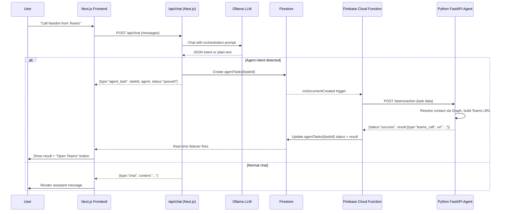

# Agentic Model Integration — SnitchX

Build a complete agent execution pipeline: user sends message → Parent LLM detects intent → Firestore task queue → Firebase Cloud Function → Python FastAPI agent → result rendered in chat UI.

## User Review Required

> [!IMPORTANT]
> **No Google Cloud services (Pub/Sub, Cloud Tasks, Vertex AI, KMS)** — using local Ollama + Firestore as a job queue instead.

> [!IMPORTANT]
> **Python FastAPI server must run separately** — it will be a standalone process (outside the Docker Next.js container). You need Docker or Python 3.11+ on the host to run it.

> [!WARNING]
> **Microsoft Graph credentials** — The Teams agent requires `GRAPH_CLIENT_ID` and `GRAPH_TENANT_ID` from your Azure/Entra app registration. These must be set in the agent server's [.env](file:///e:/SaaS-ai/ai-everyone/.env).

---

## Architecture Flow



---

## Proposed Changes

### Component 1: Parent LLM Orchestration (`/api/chat` upgrade)

The existing `/api/chat` route sends messages to Ollama and returns plain text. We upgrade it to:
1. Inject an **orchestration system prompt** that tells Ollama about installed agents
2. Detect if Ollama returns **structured JSON** (agent intent) vs plain text
3. If agent intent → create a task in Firestore, return task metadata to frontend
4. If plain text → return as before (backwards compatible)

#### [MODIFY] [route.ts](file:///e:/SaaS-ai/ai-everyone/src/app/api/chat/route.ts)
- Add `getOrchestrationSystemPrompt()` that describes available agents
- After Ollama response, attempt JSON parse → if valid intent, create Firestore task
- Return `{type: "agent_task", taskId, agent, status}` or `{type: "chat", content}`
- Import Firebase Admin SDK for server-side Firestore writes

---

### Component 2: Firestore Task Types & CRUD

#### [NEW] [firestore-tasks.ts](file:///e:/SaaS-ai/ai-everyone/src/lib/firestore-tasks.ts)
- `AgentTask` interface: `taskId, userId, agentId, status, parentLLMRequest, agentInput, agentOutput, createdAt, startedAt, finishedAt, retryCount`
- `createAgentTask(data)` — write to `agentTasks/{taskId}` (Admin SDK, server-side)
- `getAgentTask(taskId)` — read (client-side, for real-time listener)
- `getUserTasks(uid)` — list user's tasks

#### [MODIFY] [types.ts](file:///e:/SaaS-ai/ai-everyone/src/modules/chat/types.ts)
- Add `AgentTask` type
- Add `"agent"` to `MessageRole` type
- Add `taskId?` field to `ChatMessage` for linking messages to agent tasks

---

### Component 3: Firebase Admin SDK (server-side Firestore)

#### [NEW] [firebase-admin.ts](file:///e:/SaaS-ai/ai-everyone/src/lib/firebase-admin.ts)
- Initialize Firebase Admin SDK using [serviceAccountKey.json](file:///e:/SaaS-ai/ai-everyone/serviceAccountKey.json)
- Export `adminDb` (Admin Firestore instance) for server-side writes
- Used by API routes to write to `agentTasks` collection (bypasses client security rules)

---

### Component 4: Firebase Cloud Function — Task Runner

#### [MODIFY] [index.js](file:///e:/SaaS-ai/ai-everyone/functions/index.js)
- Add `onDocumentCreated("agentTasks/{taskId}")` trigger
- Read task data, determine agent by `agentId` field
- Update status to `"running"`, set `startedAt`
- Make HTTP POST to agent server URL (`AGENT_SERVER_URL` from env)
- On success: write `agentOutput`, set status `"success"`, set `finishedAt`
- On failure: set status `"failed"`, increment `retryCount`
- Agent routing map: `{ "teams-agent": "/teams/action" }`

---

### Component 5: Python FastAPI Agent Server

#### [NEW] [server.py](file:///e:/SaaS-ai/ai-everyone/agents/teams-agent/server.py)
- FastAPI app with `POST /teams/action` endpoint
- Accepts task JSON, calls `run_teams_action()` from the refactored agent
- Returns structured JSON result

#### [NEW] [teams_agent.py](file:///e:/SaaS-ai/ai-everyone/agents/teams-agent/teams_agent.py)
- Refactored version of `Teams_msg_call_instant/files (1)/assistant_agent.py`
- **Removed**: `subprocess.run`, `webbrowser.open`, `input()` loop, CLI output
- **Changed**: [execute_action()](file:///e:/SaaS-ai/ai-everyone/Teams_msg_call_instant/files%20%281%29/assistant_agent.py#290-309) returns a JSON dict with `{type, url, displayName, email}` instead of opening URLs
- **Changed**: [run_agent()](file:///e:/SaaS-ai/ai-everyone/Teams_msg_call_instant/files%20%281%29/assistant_agent.py#342-477) → `run_teams_action(task_data)` — takes structured input, returns structured output
- Reads Ollama URL & Graph creds from environment variables

#### [NEW] [requirements.txt](file:///e:/SaaS-ai/ai-everyone/agents/teams-agent/requirements.txt)
- `fastapi`, `uvicorn`, `requests`, `msal`

#### [NEW] [.env.example](file:///e:/SaaS-ai/ai-everyone/agents/teams-agent/.env.example)
- `OLLAMA_URL`, `OLLAMA_MODEL`, `GRAPH_TENANT_ID`, `GRAPH_CLIENT_ID`

---

### Component 6: Frontend — Agent Task Rendering

#### [MODIFY] [chat-context.tsx](file:///e:/SaaS-ai/ai-everyone/src/modules/chat/context/chat-context.tsx)
- After receiving `{type: "agent_task"}` from API, save an "agent" message in chat
- Set up Firestore `onSnapshot` listener on `agentTasks/{taskId}` for real-time updates
- When task completes, update the agent message with the result

#### [NEW] [agent-task-message.tsx](file:///e:/SaaS-ai/ai-everyone/src/modules/chat/ui/components/agent-task-message.tsx)
- Renders agent tasks in chat: shows agent name, status badge, and action button
- Status: `queued` (spinner) → `running` (animated) → `success` (result) / `failed` (error)
- For [teams_call](file:///e:/SaaS-ai/ai-everyone/Teams_msg_call_instant/files%20%281%29/assistant_agent.py#275-288) results: renders "Open Teams Call" button that opens the URL
- For `teams_message` results: renders "Open Teams Chat" button

#### [MODIFY] [chat-message-item.tsx](file:///e:/SaaS-ai/ai-everyone/src/modules/chat/ui/components/chat-message-item.tsx)
- If `message.role === "agent"` and `message.taskId`, render `AgentTaskMessage` instead

---

### Component 7: Environment & Configuration

#### [MODIFY] [.env](file:///e:/SaaS-ai/ai-everyone/.env)
- Add `AGENT_SERVER_URL=http://host.docker.internal:8100` (for the Cloud Function to call)
- Add `GRAPH_TENANT_ID` and `GRAPH_CLIENT_ID` placeholders

#### [MODIFY] Firestore Security Rules
```diff
+ match /agentTasks/{taskId} {
+   allow create: if request.auth != null && request.resource.data.userId == request.auth.uid;
+   allow read: if request.auth != null && resource.data.userId == request.auth.uid;
+   allow update: if false; // only server/Cloud Functions update tasks
+ }
```

---

## File Structure (new/modified files)

```
e:\SaaS-ai\ai-everyone\
├── .env                                    [MODIFY] add agent server URL
├── agents/                                 [NEW] Python agent directory
│   └── teams-agent/
│       ├── server.py                       [NEW] FastAPI wrapper
│       ├── teams_agent.py                  [NEW] refactored from assistant_agent.py
│       ├── requirements.txt                [NEW]
│       └── .env.example                    [NEW]
├── functions/
│   └── index.js                            [MODIFY] add task runner trigger
├── src/
│   ├── app/api/chat/route.ts               [MODIFY] add orchestration
│   ├── lib/
│   │   ├── firebase-admin.ts               [NEW] Admin SDK init
│   │   └── firestore-tasks.ts              [NEW] agentTasks CRUD
│   └── modules/chat/
│       ├── types.ts                        [MODIFY] add agent types
│       ├── context/chat-context.tsx         [MODIFY] handle agent tasks
│       └── ui/components/
│           ├── agent-task-message.tsx       [NEW] agent result renderer
│           └── chat-message-item.tsx        [MODIFY] detect agent messages
```

---

## Verification Plan

### Automated Tests
1. `npm run build` inside Docker — ensure no TypeScript errors
2. Start the Python FastAPI server: `cd agents/teams-agent && uvicorn server:app --port 8100`
3. Deploy Firebase Functions to emulator: `firebase emulators:start --only functions`

### Manual End-to-End Test
1. Ensure Ollama is running with `qwen2.5:7b`
2. Send "Call Nandini from Teams" in the chat UI
3. Verify: Ollama returns intent JSON → task created in Firestore → Cloud Function triggers → agent called → result appears in chat with "Open Teams" button
